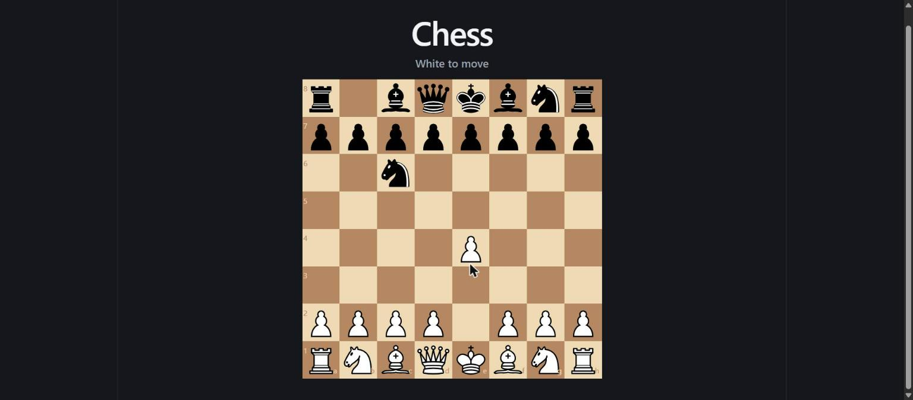

# ai-engineering-lab

A hands-on lab for learning **AI agent architecture** — the pieces that make a coding
assistant like Claude Code useful on a real project: rules, skills, slash commands,
subagents, hooks, a memory bank, and RAG.

Rather than reading about them, I built each one, wired them together, and then used
them to build something real: a chess game whose opponent picks its moves with an LLM,
grounded by retrieved chess knowledge.



**[→ Live demo](https://francisco-s-rangel.github.io/ai-engineering-lab/)** — see the
note on what the hosted version can and can't do, below.

---

## What's in here

Two things live side by side in this repo, and it's worth separating them:

**1. The agent architecture** (`.claude/`) — tooling that shapes how Claude Code
behaves while working *on* this project.

| Piece | What it does |
|---|---|
| `CLAUDE.md` | Always-loaded project rules: stack, commands, conventions |
| `skills/` | Loaded on demand — component conventions, test conventions |
| `commands/` | Slash commands: `/new-component`, `/rebuild-rag`, `/search-repo` |
| `agents/` | Subagents with isolated context: a code reviewer, a test writer |
| `hooks/` | Deterministic guardrails that always fire on lifecycle events |
| `memory/` | Decisions and state that survive across sessions |
| `rag/`, `rag-chess/` | Two retrieval systems, deliberately different |

**2. The application** (`src/`, `server/`) — a chess game that uses an LLM + RAG at
runtime.

The distinction matters: skills, commands, subagents and hooks only exist *during
development sessions*. The chess opponent is ordinary application code that happens
to call an LLM. Conflating the two is an easy mistake.

## How the opponent works

```
player moves
    │
    ├─ chess.js validates and applies it
    │
    └─ POST /api/opponent-move  (Vite dev middleware — runs in Node, not the browser)
           │
           ├─ query Chroma for relevant chess principles
           ├─ ask Claude to pick a move, given FEN + legal moves + retrieved context
           ├─ validate the answer against the real legal-move list
           │     └─ illegal? one corrective retry, then fall back to a random legal move
           └─ return { move, source: "llm" | "fallback" }
```

**chess.js is the only source of truth for legality.** The model never decides what's
legal — it picks from a list it's given, and the answer is checked before it's applied.
That guard is covered by a test which was verified by deliberately removing the guard
and confirming the test fails.

## Two RAG systems, on purpose

This is the part I'd most want to explain in an interview:

|  | `.claude/rag/` | `.claude/rag-chess/` |
|---|---|---|
| **Consumer** | Claude Code, during development | The running app, at runtime |
| **Retrieval** | Keyword scoring | Vector similarity |
| **Storage** | A local JSON index | Chroma Cloud |
| **Answers** | "What did we decide about X?" | "What principles apply to this position?" |
| **Invoked by** | `/search-repo` | The opponent, every move |

They're different because their *consumers* are different — not because one is a
better version of the other. Repo search over a few dozen files doesn't need embeddings;
matching a board position to strategic prose does. Picking a vector database by default
would have been the wrong reflex.

## Running it

```bash
npm install
npm run dev      # http://localhost:5173
```

Also available: `npm run build`, `npm run lint`, `npm test`.

**Optional — enabling the real LLM opponent.** Without credentials the app still runs;
the opponent just plays random legal moves. To turn on the real thing, copy
`.env.example` to `.env` and fill in:

| Variable | Where from |
|---|---|
| `ANTHROPIC_API_KEY` | [console.anthropic.com](https://console.anthropic.com) (needs credits) |
| `CHROMA_API_KEY`, `CHROMA_TENANT`, `CHROMA_DATABASE` | Chroma Cloud dashboard → Connect panel |

Then run `/rebuild-rag` (or `node .claude/rag-chess/build-index.mjs`) to populate the
chess knowledge collection. Embeddings are generated **locally and free** via
`@chroma-core/default-embed` — no embedding API key needed.

`.env` is gitignored. `.env.example` is committed and contains placeholders only.

### About the live demo

The hosted build plays a **random** opponent, not the LLM one. `/api/opponent-move` is
Vite dev-server middleware, so it doesn't exist in a static deploy — the fetch fails and
the code falls through to its fallback. That's the graceful degradation working as
designed, but it does mean the interesting half only runs locally with keys set.

## Stack

React 19 · TypeScript · Vite 8 · Vitest · chess.js · react-chessboard · Chroma

## Further reading

[`docs/architecture.md`](docs/architecture.md) — each piece in depth, the decisions
behind them, and what went wrong along the way.
